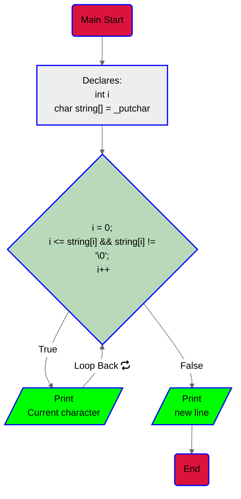
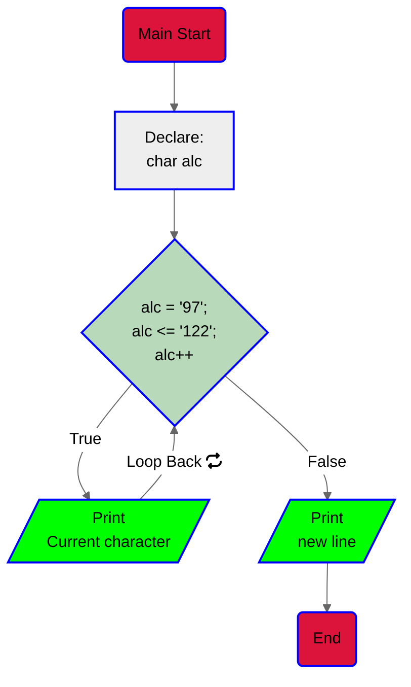
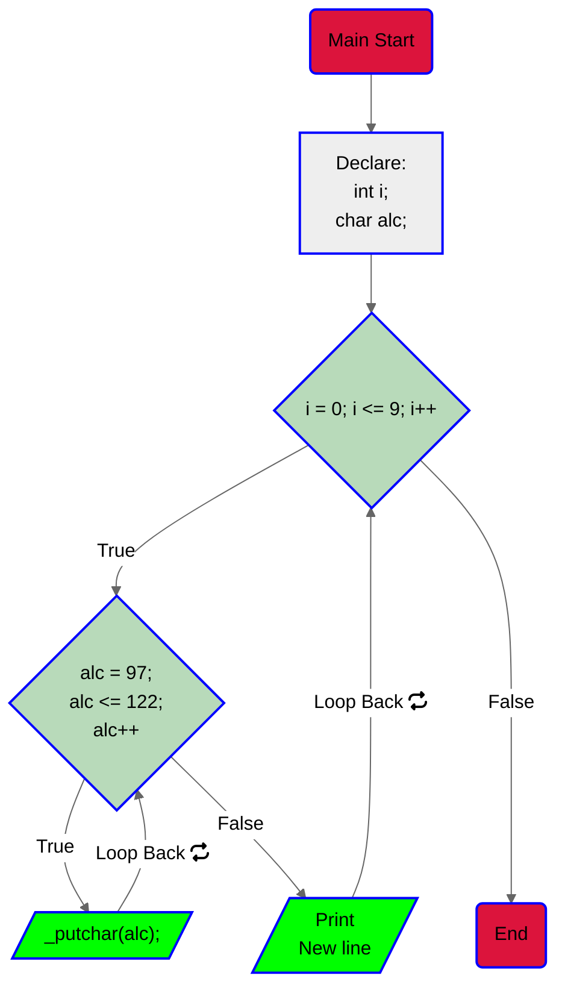

# New project: C - Functions, nested loops.

## Task 0:
For this task we are asked to: Print the string "_putchar" on the screen with
a new line at the end so we don't mess up the output.

1. Read; well  to start, in the description of the task you will find the string that
we must print to the screen.

2. We will use our own `_putchar` function or the given one if you want.
3. Write the the program that uses our function:<br>
        3.1. Declare an int variable it will be used as a iterator.<br>
        3.2. Since we have not been given the string as input we have to "make it
        appear" we will use an `array of chars` to declare the `_putchar` string.<br>
        3.3. Next, we will use a `for` loop to iterate over the array and print each
        character to the screen using our own `_putchar()` function.<br>
        3.4. After the loop, we will print a new line to the screen.<br>
        3.5. End the program returning 0.<br>

4. Flowchart:

5. [CODE](https://github.com/KevinYeff/holbertonschool-low_level_programming/blob/main/functions_nested_loops/0-putchar.c)
6. Output:
```bash
$ ./0-putchar
_putchar
$
```
> [!IMPORTANT]
> Why an array of chars? imagine the static memory as a set of cells next to
> each other |cell 1|cell 2|cell 3|...|cell n|.
> Each cell can hold a single character and what the array does
> is separate a portion of this memory, at this point the `char string[] = "_putchar"`
> will be allocated by the compiler so we don't need to be worried about that
> portion of memory so, you could say that we have a portion of space in memory
> and this "chunk" is filled with `_putchar` just like : |_|p|u|t|c|h|a|r|'\0|'.
> About the bucle for: if you are not familiar with C language or programming,
> it will be hard to understand the loop declaration, well let's make it simple,
> at this point we know that the array is like a portion of ordered memory cells
> and we also know that our own function `_putchar()` prints characters one by
> one, with this in mind, we tell the loop, "hey for each time including the start
> taking into account that the position is less than and equal to 0 and the
> current position is different from `'\0'` (the null char), **print! the content
> of that cell and at the same time move the iterator to the next position** so
> you don't print the same content the next time.

> [!TIP]
> Imagine memory as a set of ordered cells (space).
> The '\0' char is used to indicate the end of a string.
> You can declare the amount of space for an array content by doing this:
> ```c
> char string[10] = "_putchar"
>```

> [!NOTE]
> The flowchart is a representation of the program's logic and is not a code.
> Arrays are cool.
> '\0' the null one, seems like it is saying "hi" right? :D

> [!CAUTION]
> Can u do this or no?:
> ```c
> char string[8] = "_putchar"
>```
> :P ?
> The answer is: ab, orpnhfr gur fgevat "_chgpune" unf 8 punenpgref naq gur >
> neenl vf qrpynerq jvgu 8 pryyf, ohg gur ynfg bar vf hfrq gb fgber gur ahyy >
> punenpgre '' fb gur neenl vf npghnyyl hfrq gb fgber 9 punenpgref.

## Task 1
In this task we are asked to write a function that prints the alphabet in
lower case with a new line at the end and we can only use `_putchar()`
fuction only twice in ur code.

1. Read the rask.
2. set everything up (header file).
3. Code<br>
    3.1. Declare a char variable, we are going to use this variable as an
        iterator that will go through ASCII values. I named it as `alc`
        stands for `alphabet in lower case` but you can named it `i` if you
        want<br>
    3.2. Use a `for` loop to go through the ASCII values from 97 to 122
        (inclusive) and print the corresponding character using `_putchar()`.<br>
    3.3. Print the new line.<br>
    3.4. End.<br>
4. Flowchart:

5. [Code](https://github.com/KevinYeff/holbertonschool-low_level_programming/blob/main/functions_nested_loops/1-alphabet.c)
6. Output:
```bash
$ ./1-alphabet
abcdefghijklmnopqrstuvwxyz
$
```
> [!IMPORTANT]
> Remember that the ASCII value of 'a' is 97 and the ASCII value of 'z' is 122

>[!TIP]
> You can use the ASCII table to find the ASCII value of any character.
> You can also use the `man ascii` command in your terminal to see the ASCII table.

>[!NOTE]
> This task is a good practice for using loops and ASCII values. It's also a good practice
> for using the `_putchar()` function.

## Task 2
Well in this task we are asked to print the alphabe in lower case 10 times
separated by a new line at the end.

1. Read the task.
2. set everything up (main and header files).
3. Code.<br>
    3.1. Declare variables `int i` as iterator and `char alc` to
    relate it to the characters.<br>
    3.2. Use a nested `for` loop the fisrt one will be used to encompass
    each turn and also takes care of the new line, the second `for` loop
    to go through the ASCII values from 97 to 122 (included) and print
    the corresponding character using our `_putchar()` function.<br>
    3.3. Print a new line at the end of each turn (mentioned previously).<br>
    3.4. End the program.
4. Flowchart:

5. [Code](https://github.com/KevinYeff/holbertonschool-low_level_programming/blob/main/functions_nested_loops/2-print_alphabet_x10.c)
6. Output:
```bash
$ ./2-alphabet_x10
abcdefghijklmnopqrstuvwxyz
abcdefghijklmnopqrstuvwxyz
abcdefghijklmnopqrstuvwxyz
abcdefghijklmnopqrstuvwxyz
abcdefghijklmnopqrstuvwxyz
abcdefghijklmnopqrstuvwxyz
abcdefghijklmnopqrstuvwxyz
abcdefghijklmnopqrstuvwxyz
abcdefghijklmnopqrstuvwxyz
abcdefghijklmnopqrstuvwxyz
$
```
