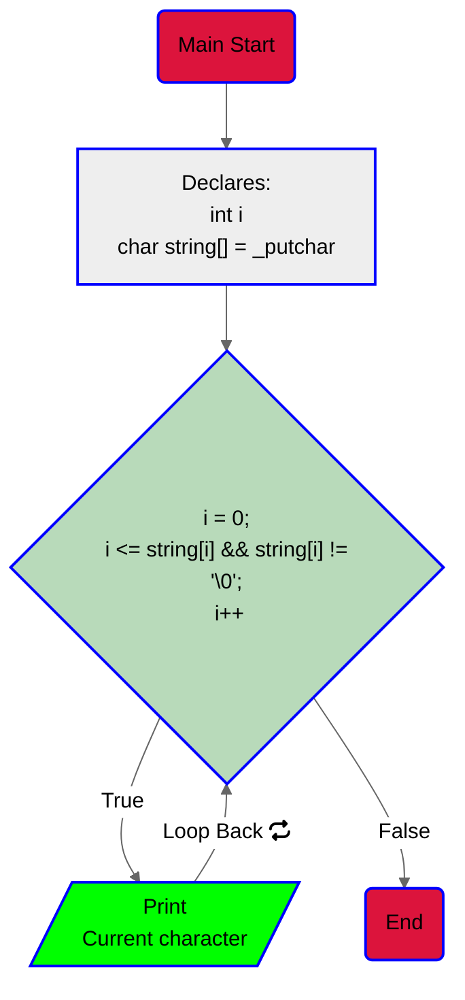

# New project: C - Functions, nested loops.

## Task 0:
For this task we are asked to: Print the string "_putchar" on the screen with
a new line at the end so we don't mess up the output.

1. Read; well  to start, in the description of the task you will find the string that
we must print to the screen.

2. We will use our own `_putchar` function or the given one if you want.
3. Write the the program that uses our function:
3.1. Declare an int variable it will be used as a iterator.
3.2. Since we have not been given the string as input we have to "make it
appear" we will use an `array of chars` to declare the `_putchar` string.
3.3. Next, we will use a `for` loop to iterate over the array and print each
character to the screen using our own `_putchar()` function.
3.4. After the loop, we will print a new line to the screen.
3.5. End the program returning 0.

4. Flowchart:


> [!IMPORTANT]
> Why an array of chars? imagine the static memory as a set of cells next to
> each other |cell 1|cell 2|cell 3|...|cell n|.
> Each cell can hold a single character and what the array does
> is separate a portion of this memory, at this point the `char string[] = "_putchar"`
> will be allocated by the compiler so we don't need to be worried about that
> portion of memory so, you could say that we have a portion of space in memory
> and this "chunk" is filled with `_putchar` just like : |_|p|u|t|c|h|a|r|'\0|'.
> About the bucle for: if you are not familiar with C language or programming,
> it will be hard to understand the loop declaration, well let's make it simple,
> at this point we know that the array is like a portion of ordered memory cells
> and we also know that our own function `_putchar()` prints characters one by
> one, with this in mind, we tell the loop, "hey for each time including the start
> taking into account that the position is less than and equal to 0 and the
> current position is different from `'\0'` (the null char), **print! the content
> of that cell and at the same time move the iterator to the next position** so
> you don't print the same content the next time.

> [!TIP]
> Imagine memory as a set of ordered cells (space).
> The '\0' char is used to indicate the end of a string.
> You can declare the amount of space for an array content by doing this:
> ```c
> char string[10] = "_putchar"
>```

> [!NOTE]
> The flowchart is a representation of the program's logic and is not a code.
> Arrays are cool.
> '\0' the null one, seems like it is saying "hi" right? :D

> [!CAUTION]
> Can u do this or no?:
> ```c
> char string[8] = "_putchar"
>```
> :P ?
> The answer is: ab, orpnhfr gur fgevat "_chgpune" unf 8 punenpgref naq gur >
> neenl vf qrpynerq jvgu 8 pryyf, ohg gur ynfg bar vf hfrq gb fgber gur ahyy >
> punenpgre '' fb gur neenl vf npghnyyl hfrq gb fgber 9 punenpgref.

