# New project: C - Functions, nested loops.

## Task 0:
For this task we are asked to: Print the string "_putchar" on the screen with
a new line at the end so we don't mess up the output.

1. Read; well  to start, in the description of the task you will find the string that
we must print to the screen.

2. We will use our own `_putchar` function or the given one if you want.
3. Write the the program that uses our function:<br>
        3.1. Declare an int variable it will be used as a iterator.<br>
        3.2. Since we have not been given the string as input we have to "make it
        appear" we will use an `array of chars` to declare the `_putchar` string.<br>
        3.3. Next, we will use a `for` loop to iterate over the array and print each
        character to the screen using our own `_putchar()` function.<br>
        3.4. After the loop, we will print a new line to the screen.<br>
        3.5. End the program returning 0.<br>

4. Flowchart:
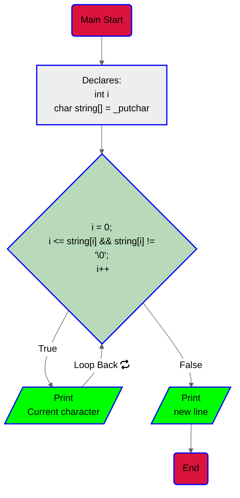
5. [CODE](https://github.com/KevinYeff/holbertonschool-low_level_programming/blob/main/functions_nested_loops/0-putchar.c)
6. Output:
```bash
$ ./0-putchar
_putchar
$
```
> [!IMPORTANT]
> Why an array of chars? imagine the static memory as a set of cells next to
> each other |cell 1|cell 2|cell 3|...|cell n|.
> Each cell can hold a single character and what the array does
> is separate a portion of this memory, at this point the `char string[] = "_putchar"`
> will be allocated by the compiler so we don't need to be worried about that
> portion of memory so, you could say that we have a portion of space in memory
> and this "chunk" is filled with `_putchar` just like : |_|p|u|t|c|h|a|r|'\0|'.
> About the bucle for: if you are not familiar with C language or programming,
> it will be hard to understand the loop declaration, well let's make it simple,
> at this point we know that the array is like a portion of ordered memory cells
> and we also know that our own function `_putchar()` prints characters one by
> one, with this in mind, we tell the loop, "hey for each time including the start
> taking into account that the position is less than and equal to 0 and the
> current position is different from `'\0'` (the null char), **print! the content
> of that cell and at the same time move the iterator to the next position** so
> you don't print the same content the next time.

> [!TIP]
> Imagine memory as a set of ordered cells (space).
> The '\0' char is used to indicate the end of a string.
> You can declare the amount of space for an array content by doing this:
> ```c
> char string[10] = "_putchar"
>```

> [!NOTE]
> The flowchart is a representation of the program's logic and is not a code.
> Arrays are cool.
> '\0' the null one, seems like it is saying "hi" right? :D

> [!CAUTION]
> Can u do this or no?:
> ```c
> char string[8] = "_putchar"
>```
> :P ?
> The answer is: ab, orpnhfr gur fgevat "_chgpune" unf 8 punenpgref naq gur >
> neenl vf qrpynerq jvgu 8 pryyf, ohg gur ynfg bar vf hfrq gb fgber gur ahyy >
> punenpgre '' fb gur neenl vf npghnyyl hfrq gb fgber 9 punenpgref.

## Task 1
In this task we are asked to write a function that prints the alphabet in
lower case with a new line at the end and we can only use `_putchar()`
fuction only twice in ur code.

1. Read the rask.
2. set everything up (header file).
3. Code<br>
    3.1. Declare a char variable, we are going to use this variable as an
        iterator that will go through ASCII values. I named it as `alc`
        stands for `alphabet in lower case` but you can named it `i` if you
        want<br>
    3.2. Use a `for` loop to go through the ASCII values from 97 to 122
        (inclusive) and print the corresponding character using `_putchar()`.<br>
    3.3. Print the new line.<br>
    3.4. End.<br>
4. Flowchart:
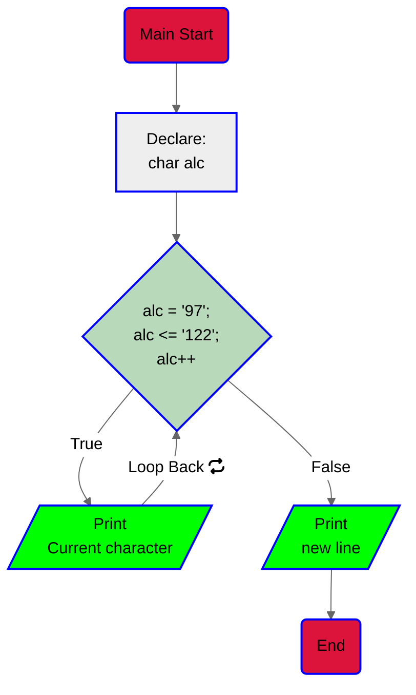
5. [Code](https://github.com/KevinYeff/holbertonschool-low_level_programming/blob/main/functions_nested_loops/1-alphabet.c)
6. Output:
```bash
$ ./1-alphabet
abcdefghijklmnopqrstuvwxyz
$
```
> [!IMPORTANT]
> Remember that the ASCII value of 'a' is 97 and the ASCII value of 'z' is 122

>[!TIP]
> You can use the ASCII table to find the ASCII value of any character.
> You can also use the `man ascii` command in your terminal to see the ASCII table.

>[!NOTE]
> This task is a good practice for using loops and ASCII values. It's also a good practice
> for using the `_putchar()` function.

## Task 2
Well in this task we are asked to print the alphabe in lower case 10 times
separated by a new line at the end.

1. Read the task.
2. set everything up (main and header files).
3. Code.<br>
    3.1. Declare variables `int i` as iterator and `char alc` to
    relate it to the characters.<br>
    3.2. Use a nested `for` loop the fisrt one will be used to encompass
    each turn and also takes care of the new line, the second `for` loop
    to go through the ASCII values from 97 to 122 (included) and print
    the corresponding character using our `_putchar()` function.<br>
    3.3. Print a new line at the end of each turn (mentioned previously).<br>
    3.4. End the program.
4. Flowchart:
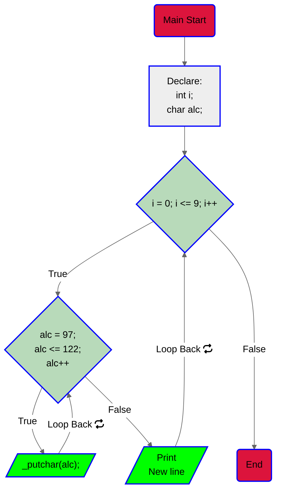
5. [Code](https://github.com/KevinYeff/holbertonschool-low_level_programming/blob/main/functions_nested_loops/2-print_alphabet_x10.c)
6. Output:
```bash
$ ./2-alphabet_x10
abcdefghijklmnopqrstuvwxyz
abcdefghijklmnopqrstuvwxyz
abcdefghijklmnopqrstuvwxyz
abcdefghijklmnopqrstuvwxyz
abcdefghijklmnopqrstuvwxyz
abcdefghijklmnopqrstuvwxyz
abcdefghijklmnopqrstuvwxyz
abcdefghijklmnopqrstuvwxyz
abcdefghijklmnopqrstuvwxyz
abcdefghijklmnopqrstuvwxyz
$
```
> [!IMPORTANT]
> Using a nested loop is key here because, this will allow us to manage the
> result, since the first loop will be in charge of providing the entry point
> for each turn (10 times) and the sencond loop will be in charge of filling
> each turn with the expected output, which in this case is the alphabet in
> lowercase.

## Task 3
We need to write a function that checks for lowercase character.
if true returns 1 otherwise returns 0.

1. Read the task.
2. Set everything up (main and header files).
3. Code.<br>
    3.1. Manage the condition o match the output, if he given char is not in
    the range of lowercase letters, the function will return 0.<br>
    3.2. If false return 1.<br>
    3.3. End.<br>
4. Flowchart:

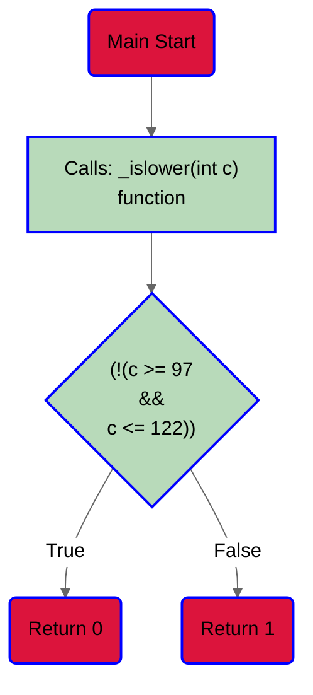
5. [Code](https://github.com/KevinYeff/holbertonschool-low_level_programming/blob/main/functions_nested_loops/3-islower.c)
6. Output:
```bash
$ ./3-islower
011
$
```
> [!IMPORTANT]
> The ASCII values are of the type of char, with this in mind we need to manage<br>
> the convertion from int to char, why? because we are returning an int value to the<br>
> `main()` function that uses our `_putchar()` function, remember that this function<br>
> only accepts char as an argument.

> [!TIP]
> You can make the code more verbose like the one before refactoring.<br>
> You can also do it whitout denying the main condition.

## Task 4
We are asked to check for alphabetic characters, letter eiter lowercase or
uppercase.

1. Read the task.
2. Set everything up (main and header files).
3. Code.<br>
    3.1. Manage the condition to match the output, if the given char is
    considered an alphabetic character return 1.<br>
    3.2. If not return 0.<br>
    3.3. End.<br>
4. Flowchart:
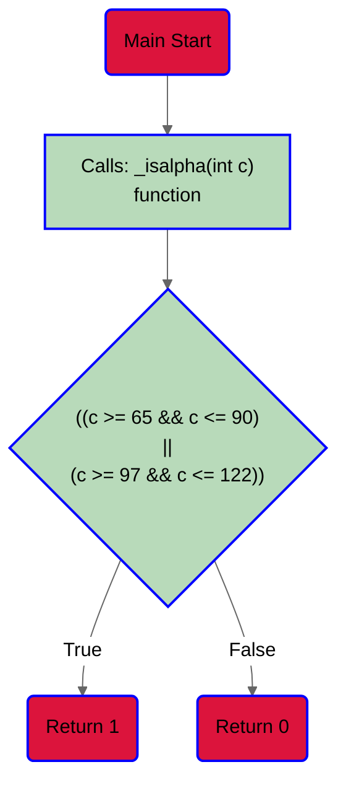
5. [Code](https://github.com/KevinYeff/holbertonschool-low_level_programming/blob/main/functions_nested_loops/4-isalpha.c)
6. Output:
```bash
$ ./4-isalpha
1110
$
```
> [!TIP]
> The ASCII values are different for uppercase letters.<br>

## Task 5
In this task we are asked to print the sign of a given number.
1. Read the task.
2. Set everything up (main and header files).
3. Code<br>
    3.1. Check if the number is positive, if so print the `+` sign
    and return 1.<br>
    3.2. Check if the number is equal to `0`, if so print `0` and
    return 0.<br>
    3.3. If no condition is meet, print the `-` sign and return `-1`.<br>
    3.4. End.<br>
4. Flowchart:
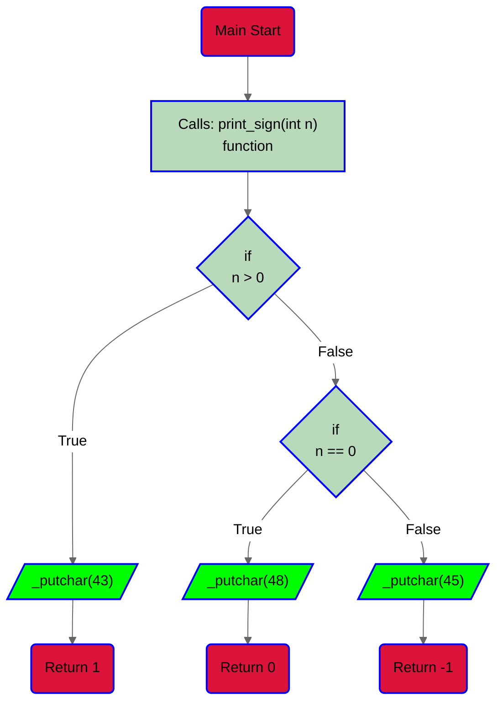
5. [Code](https://github.com/KevinYeff/holbertonschool-low_level_programming/blob/main/functions_nested_loops/5-sign.c)
6. Output:
```bash
$ ./5-sign
+, 1
0, 0
+, 1
-, /
$
```
> [!IMPORTANT]
> The previous version of my code is more readable, I just reduce lines of code.

## Task 6
In this task we are asked to wrie a function that computes the absolute value
of a given integer.

1. Read the task.
2. Set everything up (main and header files)
3. Code.<br>
    3.1. if the given integer is less than 0, convert the number to its
    positive version and return it.<br>
    3.2. if condition is not meet just return the given integer.
4. Flowchart:
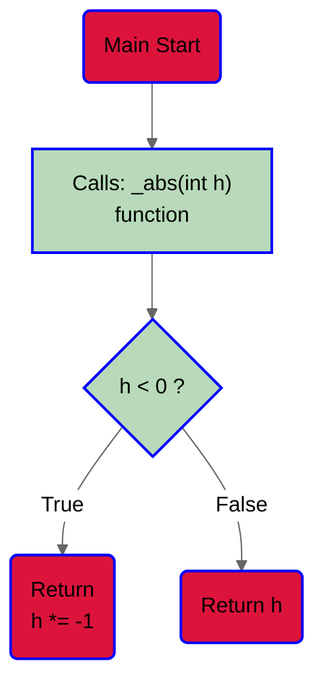
5. [Code](https://github.com/KevinYeff/holbertonschool-low_level_programming/blob/main/functions_nested_loops/6-abs.c)
6. Output:
```bash
$ ./6-abs
1
0
1
98
$
```
> [!IMPORTANT]
> The previous version of my code is more readable, I just reduce lines of code
> by usig the ternary operator that is a short hand for the well known if-else
> statement.

> [!TIP]
> The absolute value of an integer is the same integer but positive.

## Task 7
This task requieres a function that prints the last digit of a number.
1. Read the task.
2. Set everything up (main and header files)
3. Code.<br>
    3.1. Declare an int variable, it will be used to store the last digit.<br>
    3.2. Use the modulo operator to get the last digit of the number and store
    it in the variable declared in 3.1.<br>
    3.3. if the given integer is negative the las digit will be too, so we
    need to handle that case, well if this condition is true multiply the last
    digit by -1.<br>
    3.4. Print the last digit.
    3.5. Return the last digit.
4. Flowchart:
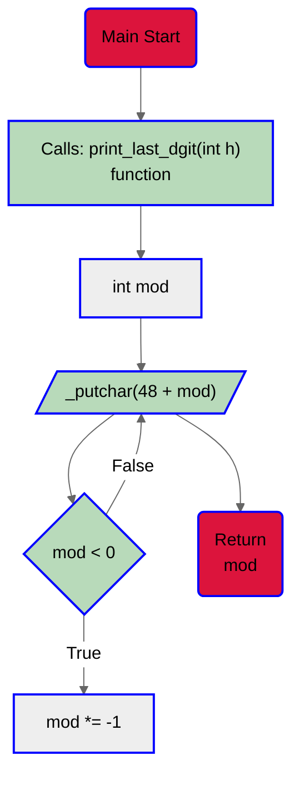
5. [Code](https://github.com/KevinYeff/holbertonschool-low_level_programming/blob/main/functions_nested_loops/7-print_last_digit.c)
6. Output:
```bash
$ ./print_last_digit 7
8044
```
> [!IMPORTANT]
> The `_putchar()` function is used to print a character, knowing this we need<br>
> to convert the integer in to a char to be printed by `_putchar()`. <br>
> Thats why we use the 48 that is the ASCCI value for the char `0`.<br>
> So with this, we can say that `_putchar()` function understands integer values <br>
> but prints chars.

> [!TIP]
> You can also use a ternary operaor just like the previous task.<br>
> The modulo operator is used to get the remainder of a division.<br>
> You can also use the `_abs()` function, because it is alread in your header
> file.<br>

> [!CAUTION]
> What happends if we don't use the number 48 while using `_puhchar()` function
> when trying to print a digit?<br>
> Answer is Gur `_putchar()` shapgvba jvyy cevag n pune, ohg gur pune jvyy abg or n qvtvg.

## Task 8
In this task we are asked to print every instance of time line per line
starting from 00:00 to 23:59.

1. Read, review the task.
2. Watch for hints like output format.
3. Set everything up (main and header files).
4. Write the code.<br>
    4.1. Declare int variables h, m.<br>
    4.2. Use a for loop to iterate over the hours from 0 to 23.<br>
    4.3. Use another for loop to iterate over the minutes from 0 to 59.<br>
    4.4. Print the time in the format HH:MM using our aux function `_print_time()` <br>
    4.5. The `_print_time()` function recieves the `h` and `m` values and
    treats them to match the output.<br>
5. Flowchart:
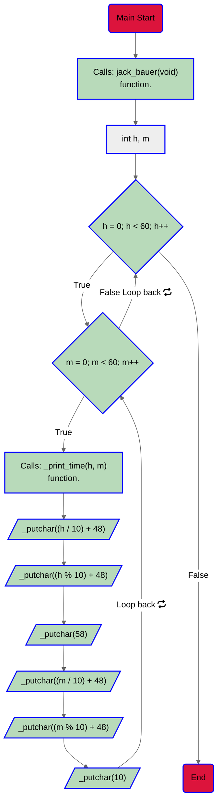
6. [Code](https://github.com/KevinYeff/holbertonschool-low_level_programming/blob/main/functions_nested_loops/8-24_hours.c)
7. Output:
```bash
$ ./8-24 | head
00:00
00:01
00:02
00:03
00:04
00:05
00:06
00:07
00:08
00:09
$ ./8-24 | tail
23:50
23:51
23:52
23:53
23:54
23:55
23:56
23:57
23:58
23:59
$ ./8-24 | wc -l
1440
$
```
> [!IMPORTANT]
> If applying modulo 10 to a integer results in giving us the last digit, applying divide by 10
> to a integer will result in *removing the last digit of the integer*.

> [!CAUTION]
> What will happen if we divide 1994 by 10, what would be the output in C?

## Task 9
This task asks us to print the 9 times table not only that since we will have
to do i in a format with a curious order, if you do not check the format it is
possible to get lost haha jk!

1. Read, analize the task.
2. Set everythingup (main, header files).
3. Code.<br>
    3.1. Declare 3 variables of type int, named them what you want.<br>
    3.2. For this task I'm using a nested for loop, the first one limits the output
    up to 10 lines.<br>
    3.3. The second loop is used to print the 9 times table.<br>
    3.4. It start calculating the result of `factor1` times `factor2` and store it
    in the variable `result`.<br>
    3.5. Calls an aux function named `prints_format()`.<br>
    3.6. The function `prints_format()` takes 2 parameters, `factor2` and `product`<br>
    3.7. Prints the 9 times table based on this 2 parameters and the given output.
4. Flowchart:
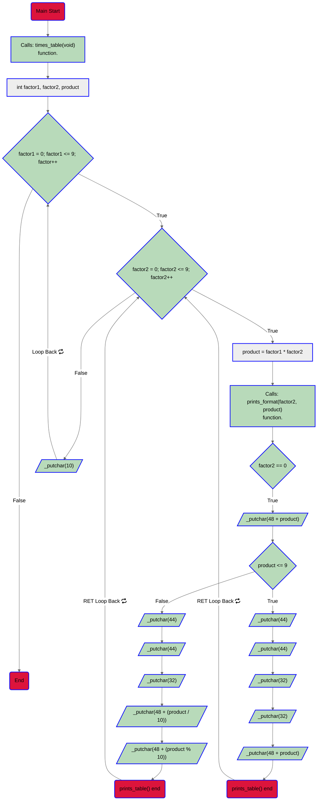

5. [Code](https://github.com/KevinYeff/holbertonschool-low_level_programming/blob/main/functions_nested_loops/9-times_table.c)
6. Output:
```bash
$ ./9-times_table
0,  0,  0,  0,  0,  0,  0,  0,  0,  0
0,  1,  2,  3,  4,  5,  6,  7,  8,  9
0,  2,  4,  6,  8, 10, 12, 14, 16, 18
0,  3,  6,  9, 12, 15, 18, 21, 24, 27
0,  4,  8, 12, 16, 20, 24, 28, 32, 36
0,  5, 10, 15, 20, 25, 30, 35, 40, 45
0,  6, 12, 18, 24, 30, 36, 42, 48, 54
0,  7, 14, 21, 28, 35, 42, 49, 56, 63
0,  8, 16, 24, 32, 40, 48, 56, 64, 72
0,  9, 18, 27, 36, 45, 54, 63, 72, 81
$ ./a.out | tr ' ' . | cat -e
0,..0,..0,..0,..0,..0,..0,..0,..0,..0$
0,..1,..2,..3,..4,..5,..6,..7,..8,..9$
0,..2,..4,..6,..8,.10,.12,.14,.16,.18$
0,..3,..6,..9,.12,.15,.18,.21,.24,.27$
0,..4,..8,.12,.16,.20,.24,.28,.32,.36$
0,..5,.10,.15,.20,.25,.30,.35,.40,.45$
0,..6,.12,.18,.24,.30,.36,.42,.48,.54$
0,..7,.14,.21,.28,.35,.42,.49,.56,.63$
0,..8,.16,.24,.32,.40,.48,.56,.64,.72$
0,..9,.18,.27,.36,.45,.54,.63,.72,.81$
```
> [!TIP]
> Check the previous tips, and you will be able to match the output.
> Order maters when chaining conditions.

## Task 10
This task is kinda easy it asks us to add two integers.
1. Read the task.
2. Set everything up (main, header files).
3. Code.<br>
    3.1. `return` the addition between two integers.<br>
4. Flowchart:
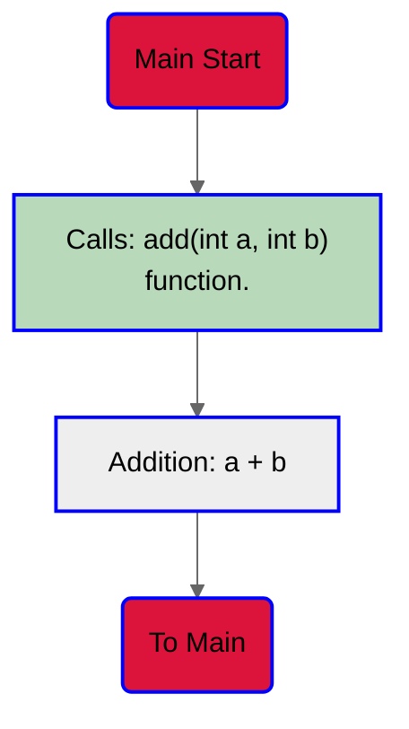
5. [Code](https://github.com/KevinYeff/holbertonschool-low_level_programming/blob/main/functions_nested_loops/10-add.c)
6. Output:
```bash
$ ./10-add
98
$
```
> [!TIP]
> You can use the `return` keyword to perform almost any operation.

## Task 11
This task asks us to print all natural numbers from n to 98, followed by a new
line.
1. Read the task.
2. Set everything up (main, header files).
3. Code.<br>
    3.1. Play with the value of n.
    3.1. Use a `for` loop to iterate from `n` to 98.<br>
    3.2. Use the `printf` function to print the numbers and a specific
    format string.<br>
    3.3. Play with the value of n again, is the next loop valid?<br>
    3.4. if valid, loop in reverse.<br>
    3.5. if no, just print n and a newline.<br>
    3.6. End.
4. Flowchart:
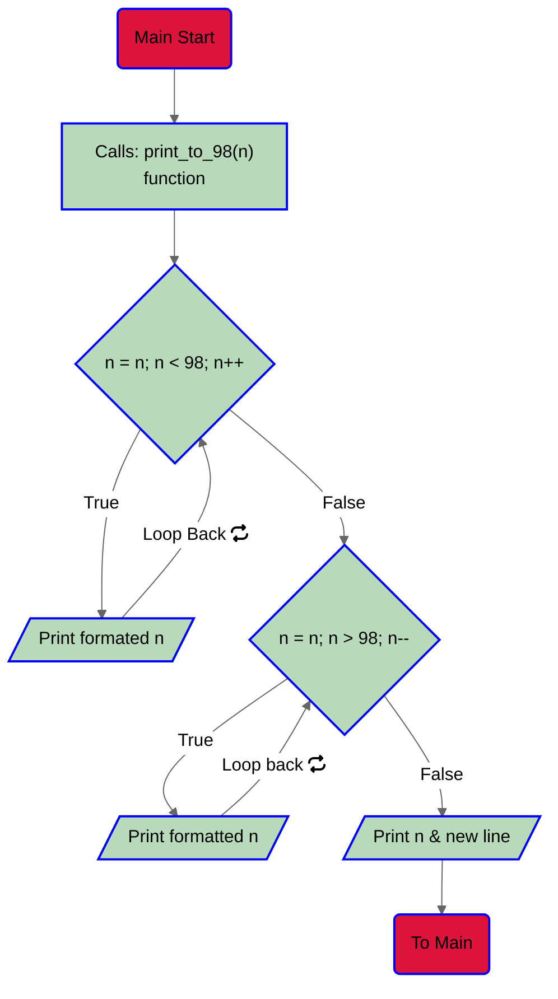
5. [Code](https://github.com/KevinYeff/holbertonschool-low_level_programming/blob/main/functions_nested_loops/11-print_to_98.c)
6. Output:
```bash
$ ./11-98
0, 1, 2, 3, 4, 5, 6, 7, 8, 9, 10, 11, 12, 13, 14, 15, 16, 17, 18, 19, 20, 21, 22, 23, 24, 25, 26, 27, 28, 29, 30, 31, 32, 33, 34, 35, 36, 37, 38, 39, 40, 41, 42, 43, 44, 45, 46, 47, 48, 49, 50, 51, 52, 53, 54, 55, 56, 57, 58, 59, 60, 61, 62, 63, 64, 65, 66, 67, 68, 69, 70, 71, 72, 73, 74, 75, 76, 77, 78, 79, 80, 81, 82, 83, 84, 85, 86, 87, 88, 89, 90, 91, 92, 93, 94, 95, 96, 97, 98
98
111, 110, 109, 108, 107, 106, 105, 104, 103, 102, 101, 100, 99, 98
81, 82, 83, 84, 85, 86, 87, 88, 89, 90, 91, 92, 93, 94, 95, 96, 97, 98
-10, -9, -8, -7, -6, -5, -4, -3, -2, -1, 0, 1, 2, 3, 4, 5, 6, 7, 8, 9, 10, 11, 12, 13, 14, 15, 16, 17, 18, 19, 20, 21, 22, 23, 24, 25, 26, 27, 28, 29, 30, 31, 32, 33, 34, 35, 36, 37, 38, 39, 40, 41, 42, 43, 44, 45, 46, 47, 48, 49, 50, 51, 52, 53, 54, 55, 56, 57, 58, 59, 60, 61, 62, 63, 64, 65, 66, 67, 68, 69, 70, 71, 72, 73, 74, 75, 76, 77, 78, 79, 80, 81, 82, 83, 84, 85, 86, 87, 88, 89, 90, 91, 92, 93, 94, 95, 96, 97, 98
```
> [!IMPORTANT]
> When I say "Play with n", what I mean is that you need to analize the behaviour
> of loops and the current values.

> [!TIP]
> rlly? haha :P : Jung lbh unir gb qb vf ybbx ng gur inyhr bs a ng gur raq bs rnpu
> ybbc naq hfr vg gb zngpu gur bhgchg.

## Task 12
This task ask us to print the n times table up to 15.
1. Read the task.
2. Analize the output.
3. Set everrything up (main, header files).
4. Code.<br>
    4.1. Declare 3 variables of type int factor1, factor2, product.<br>
    4.2. Loop from 0 to n. <br>
    4.3. Print the number 0.
    4.4. Inside use another loop, from 1 to n.<br>
    4.5. Multiply factor1 times factor2, save it into product.<br>
    4.6. Print `,` character.<br>
    4.7. Print ` ` character.<br>
    4.8. Call auxi function `print_table()` function.<br>
    4.9. After the second loop has ended print a new line<br>
    4.10. End the program after the first loop ends.
5. Flowchart:
```mermaid
graph TD;
Start(Main Start)-->Call["Calls: print_times_table(int n)<br>function."]
Call-->Declare["int factor1, factor2, product"]
Declare-->Condition{"n <= 15 && n >= 0"}
Condition-- True-->Loop{"factor1 = 0; factor1 <= n; factor++"}
Loop--True-->Print[/"Print 0"/]
Print-->Loop2{"factor2 = 1; factor2 <= n; factor2++"}
Loop-- False-->Condition-- False-->End2(End, To main)
Loop2--True-->Operation["product = factor1 * factor2"]
Operation-->Print1[/"Print comma char"/]
Print1-->Print2[/"Print space char"/]
Print2-->Call2["Calls: Aux print_table(product)<br> function"]
Call2-->Condition2{"product >= 100 && product <= 999"}
Condition2-- True-->Print3[/"Print first digit"/]
Print3-->Print4[/"Print middle digit"/]
Print4-->Print5[/"Print last digit"/]
Condition2-- False-->Condition3{"product >= 10 && product <= 99"}
Print5-- Else if-->Condition3
Condition3-- True-->Print6[/"Print space char"/]
Print6-->Print7[/"Print first digit"/]
Print7-->Print8[/"Print last digit"/]
Condition3-- False/Else-->Print9[/"Print space char"/]
Print9-->Print10[/"Print space char"/]
Print10-->Print11[/"Print product"/]
Print11-->End("Aux fn ends")
End-- RET Loop || Back fa:fa-repeat-->Loop2
Loop2-- False----->Print12[/"Print new line"/]
Print12-- Loop || Back fa:fa-repeat-->Loop



style Start fill:crimson,stroke:blue,stroke-width:2px
style Call fill:#b8daba,stroke:blue,stroke-width:2px
style Declare stroke:blue,stroke-width:2px
style Operation stroke:blue,stroke-width:2px
style Loop fill:#b8daba,stroke:blue,stroke-width:2px
style Loop2 fill:#b8daba,stroke:blue,stroke-width:2px
style Condition fill:#b8daba,stroke:blue,stroke-width:2px
style Condition2 fill:#b8daba,stroke:blue,stroke-width:2px
style Condition3 fill:#b8daba,stroke:blue,stroke-width:2px
style Call2 fill:#b8daba,stroke:blue,stroke-width:2px
style Print fill:#b8daba,stroke:blue,stroke-width:2px
style Print1 fill:#b8daba,stroke:blue,stroke-width:2px
style Print2 fill:#b8daba,stroke:blue,stroke-width:2px
style Print3 fill:#b8daba,stroke:blue,stroke-width:2px
style Print4 fill:#b8daba,stroke:blue,stroke-width:2px
style Print5 fill:#b8daba,stroke:blue,stroke-width:2px
style Print6 fill:#b8daba,stroke:blue,stroke-width:2px
style Print7 fill:#b8daba,stroke:blue,stroke-width:2px
style Print8 fill:#b8daba,stroke:blue,stroke-width:2px
style Print9 fill:#b8daba,stroke:blue,stroke-width:2px
style Print10 fill:#b8daba,stroke:blue,stroke-width:2px
style Print11 fill:#b8daba,stroke:blue,stroke-width:2px
style Print12 fill:#b8daba,stroke:blue,stroke-width:2px
style End fill:crimson,stroke:blue,stroke-width:2px
style End2 fill:crimson,stroke:blue,stroke-width:2px
%%{init:{
    'theme': 'neutral'
}}%%
```
6. [Code](https://github.com/KevinYeff/holbertonschool-low_level_programming/blob/main/functions_nested_loops/100-times_table.c)
7. Output:
```bash
$ ./100-times_table
0,   0,   0,   0
0,   1,   2,   3
0,   2,   4,   6
0,   3,   6,   9

0,   0,   0,   0,   0,   0
0,   1,   2,   3,   4,   5
0,   2,   4,   6,   8,  10
0,   3,   6,   9,  12,  15
0,   4,   8,  12,  16,  20
0,   5,  10,  15,  20,  25


0,   0,   0,   0,   0,   0,   0,   0,   0,   0,   0,   0,   0
0,   1,   2,   3,   4,   5,   6,   7,   8,   9,  10,  11,  12
0,   2,   4,   6,   8,  10,  12,  14,  16,  18,  20,  22,  24
0,   3,   6,   9,  12,  15,  18,  21,  24,  27,  30,  33,  36
0,   4,   8,  12,  16,  20,  24,  28,  32,  36,  40,  44,  48
0,   5,  10,  15,  20,  25,  30,  35,  40,  45,  50,  55,  60
0,   6,  12,  18,  24,  30,  36,  42,  48,  54,  60,  66,  72
0,   7,  14,  21,  28,  35,  42,  49,  56,  63,  70,  77,  84
0,   8,  16,  24,  32,  40,  48,  56,  64,  72,  80,  88,  96
0,   9,  18,  27,  36,  45,  54,  63,  72,  81,  90,  99, 108
0,  10,  20,  30,  40,  50,  60,  70,  80,  90, 100, 110, 120
0,  11,  22,  33,  44,  55,  66,  77,  88,  99, 110, 121, 132
0,  12,  24,  36,  48,  60,  72,  84,  96, 108, 120, 132, 144
$
```
>[!TIP]
> This task is similar to the task #9 but this version is a little bit more tricky
> because it opens the second loop printing 0 and by doing this; factor 2 can be
> initialized from 1.

## Task 13
For this task we need to compute and print the sum of all the multiples of 3 or 5
below 1024 (excluded), followed by a new line.

1. Read the task.
2. Analize, it is you and your main function.
3. Code.<br>
    3.1. Declare 2 variables, one to act as iterator and another so store the sum.<br>
    3.2. Use a for loop to iterate backwards from 1023 to 2.<br>
    3.3. Use an if statement to sum every number that meets the condition.<br>
    3.4. Print the sum.
    3.5. Return 0.
4. Flowchart:
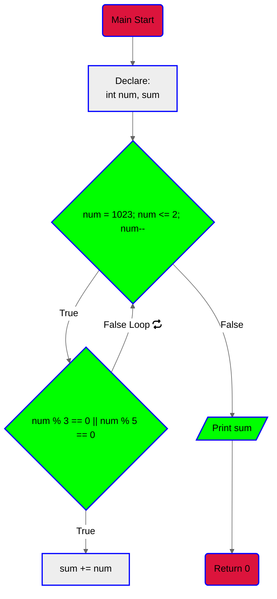
5. [Code](https://github.com/KevinYeff/holbertonschool-low_level_programming/blob/main/functions_nested_loops/101-natural.c)
6. Output:
```bash
$ ./a.out
244293
$
```
> [!TIP]
> Yes we can do it backwards.

## Task 14

In this task we are asked to print the first 50 Fibonacci numbers, starting
with 1 and 2, followed by a new line.
1. Read the task.
2. Analize.
3. Code.<br>
    3.1. Use unsigned long int type to declare 3 variables.<br>
    3.2. Use int type to declare an iterator.<br>
    3.3. Use a For loop to iterate from 0 to 49.<br>
    3.4. Sum the values of 2 uli variables.<br>
    3.5. Print the sum.
    3.6. if iterator is equal to 49 just print a new line<br>
    3.7. else print the following format ", "<br>
    3.8. Return 0.
4. Flowchart:
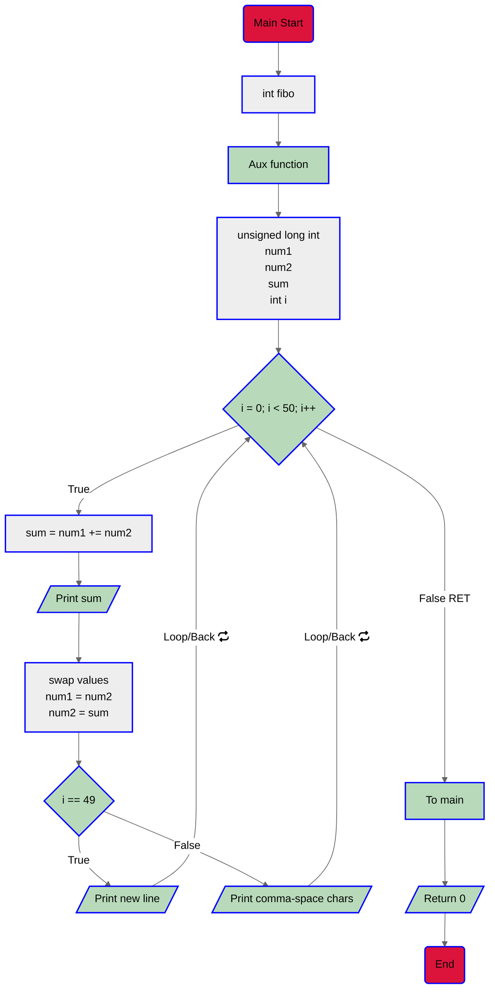
5. [Code](https://github.com/KevinYeff/holbertonschool-low_level_programming/blob/main/functions_nested_loops/102-fibonacci.c)
6. Output:
```bash
$ ./a.out
1, 2, 3, 5, 8, 13, 21, 34, 55, 89, 144, 233, 377, 610, 987, 1597, 2584, 4181, 6765, 10946, 17711, 28657, 46368, 75025, 121393, 196418, 317811, 514229, 832040, 1346269, 2178309, 3524578, 5702887, 9227465, 14930352, 24157817, 39088169, 63245986, 102334155, 165580141, 267914296, 433494437, 701408733, 1134903170, 1836311903, 2971215073, 4807526976, 7778742049, 12586269025, 20365011074
```
> [!TIP]
> Sometimes a variable of the int type is not enough for large numbers.
