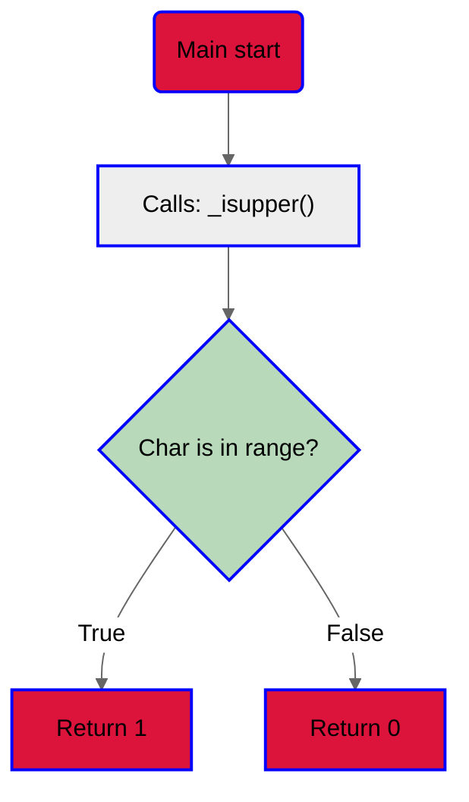
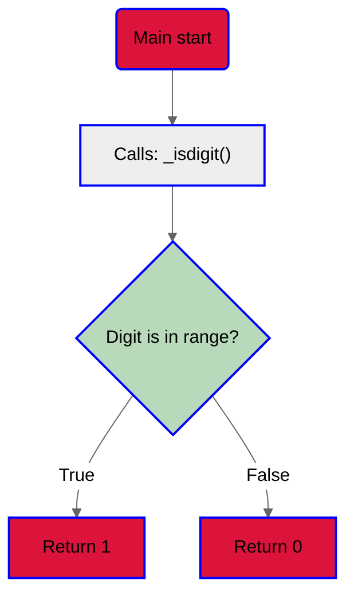
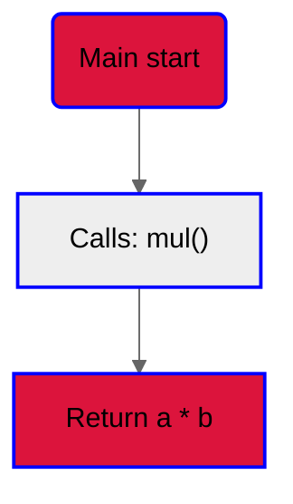
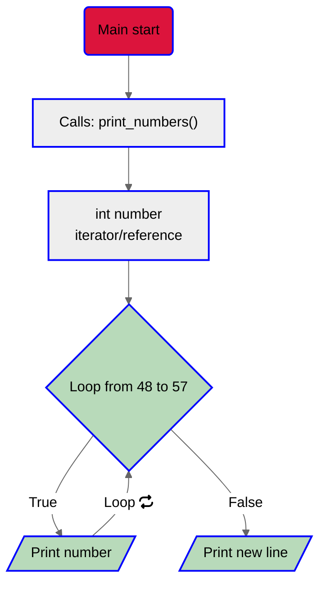
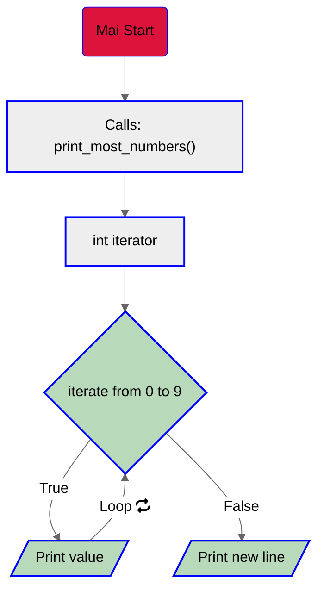
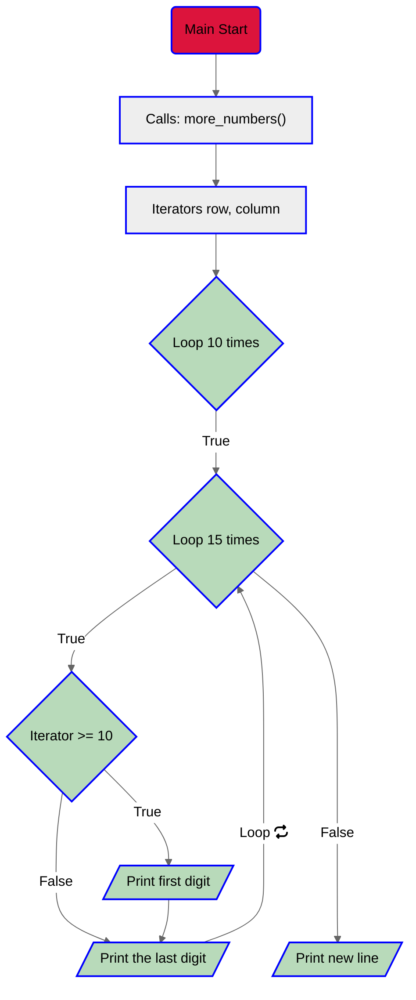
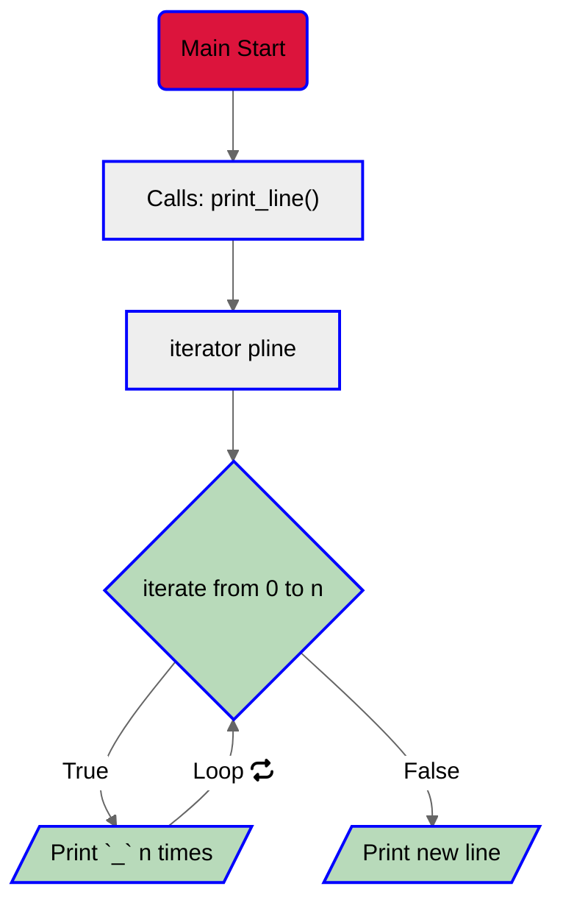
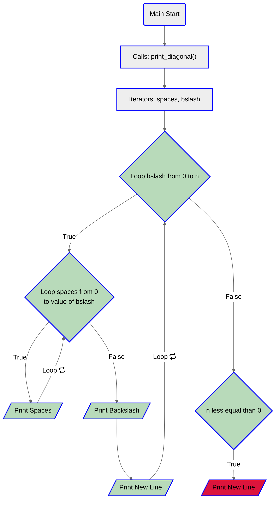

# New project: C - More functions, more nested loops.
## Taks 0
This task ask us to check if a given char is uppercase.

1. Read the task.
2. Set everything up (main, header files).
3. Code.<br
	3.1. Check if given char is in range.<br>
	3.2. if True return 1.<br>
	3.3. else return 0.<br>
	3.4. End.<br>
4. Flowchart:

5. [Code](https://github.com/KevinYeff/holbertonschool-low_level_programming/blob/main/more_functions_nested_loops/0-isupper.c)
6. Output:
```bashsize_t
$ ./a.out
A: 1
a: 0
$
```

## Task 1 
In this task  we need to check if a given digit is a number.
1. Read the task.
2. Set everything up (main, header files).
3. Code.<br>
	3.1. Check if given digit is in range.<br>
	3.2. if True return 1.<br>
	3.3. else return 0.<br>
	3.4. End.<br>
4. Flowchart:

5. [Code](https://github.com/KevinYeff/holbertonschool-low_level_programming/blob/main/more_functions_nested_loops/1-isdigit.c)

6. Output:
```bash
$ ./a.out
0: 1
a: 0
$
```
## Task 2
For this task we need to return the multiplication of 2 integers.
1. Read the task.
2. Set everything up (main, header files).
3. Code.<br>
	3.1. Multiply the integers.<br>
	3.2. return the result.<br>
4. Flowchart:

5. [Code](https://github.com/KevinYeff/holbertonschool-low_level_programming/blob/main/more_functions_nested_loops/2-mul.c)
6. Output:
```bash
$ ./a.out
100352
-1646592
$
```
## Task 3
This task asks us to print the numbers from 0 to 9.
1. Read the task.
2. Set everything up (main. header files).
3. Code. <br>
	3.1. Declare an iterator.<br>
	3.2. Use a `For Loop` to print under condition.<br>
	3.3. Print a new line after Loop ends.<br>
	3.4. End.<br>
4. Flowchart:

5. [Code](https://github.com/KevinYeff/holbertonschool-low_level_programming/blob/main/more_functions_nested_loops/3-print_numbers.c)
6. Output:
```bash
$ ./a.out 
0123456789
$
```
## Task 4
This task ask us to print numbers from 0 to 9 except 2 and 4.

1. Read the task.
2. Set everything up (main, header files).
3. Code.<br>
	3.1. Declare an iterator/reference.<br>
	3.2. Use a `For Loop` to iterate from 0  to 9.<br>
	3.3. if iterator/reference is not equal to 2 or 4, print the value.<br>
	3.4. Print a new line after loop ends.

4. Flowchart:

5. [Code](https://github.com/KevinYeff/holbertonschool-low_level_programming/blob/main/more_functions_nested_loops/4-print_most_numbers.c)
6. Output:
```bash
$ ./a.out
01356789
$
```

## Task 5
In this task we need to print the numbers from 0 to 14 included.
1. Read the task.
2. Set everything up (main, header files).
3. Code.<br>
	3.1. Declare iterators/references.<br>
	3.2. Use a nested for loop from 0 to 9.<br>
	3.3. The second loop from 0 to 14 included.<br>
	3.4. if number of iterations are greater than or equal to 10.<br>
	3.5. Print the first digit of the iterator number.<br>
	3.6. Print the last digit of the iterator number.<br>
	3.7. Print a new line after second loop ends.<br>

4.Flowchart:

5. [Code](https://github.com/KevinYeff/holbertonschool-low_level_programming/blob/main/more_functions_nested_loops/5-more_numbers.c)
6. Output:
```bash
$ ./a.out
01234567891011121314
01234567891011121314
01234567891011121314
01234567891011121314
01234567891011121314
01234567891011121314
01234567891011121314
01234567891011121314
01234567891011121314
01234567891011121314
$
```

## Task 6
This tasks asks us to print a straight line in the terminal.
1. Read the task.
2. Set everything up (main, header files)
3. Code.<br>
	3.1. Declare iterator/reference.<br>
	3.2. Use a for loop to iterate from 0 to n.<br>
	3.3. Print `_` character n times.<br>
	3.4. Print a new line after loop ends.<br>
4. Flowchart:

5. [Code](https://github.com/KevinYeff/holbertonschool-low_level_programming/blob/main/more_functions_nested_loops/6-print_line.c)
6. Output:
```bash
$ ./a.out

__
__________

$
```

## Taks 7
This tasks asks us to print a diagonal character of the size of n.

1. Read the task.
2. Set everything up (main, header files).
3. Code.<br>
	3.1. Declare two iterators/references variables.<br>
	3.2. Use a `For nested loop`.<br>
	3.3. The first one will loop from 0 to n, this also prints the<br>
	diagonal character and a new line at the n position.<br>
	3.4. The second will loop from 0 to the first iterator and this<br>
	loop will print the spaces.<br>
	3.5. Manage when n equals to 0 case after main loop ends.<br>
4. Flowchart:

5. [Code](https://github.com/KevinYeff/holbertonschool-low_level_programming/blob/main/more_functions_nested_loops/7-print_diagonal.c)
6. Output:
```bash
$ ./a.out | cat -e
$
\$
 \$
\$
 \$
  \$
   \$
    \$
     \$
      \$
       \$
        \$
         \$
$
$
```
