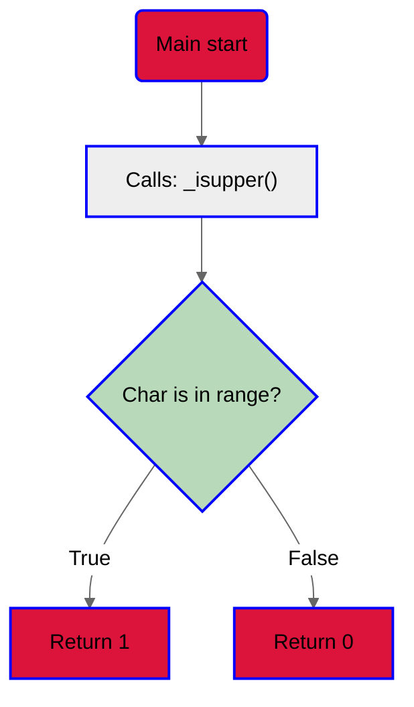
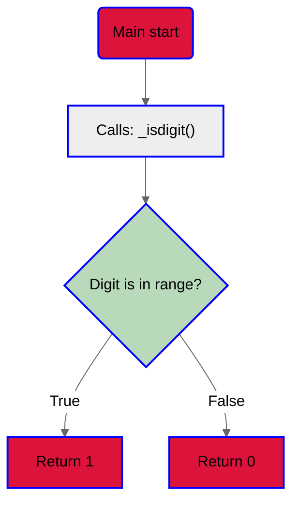
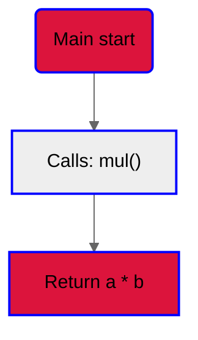
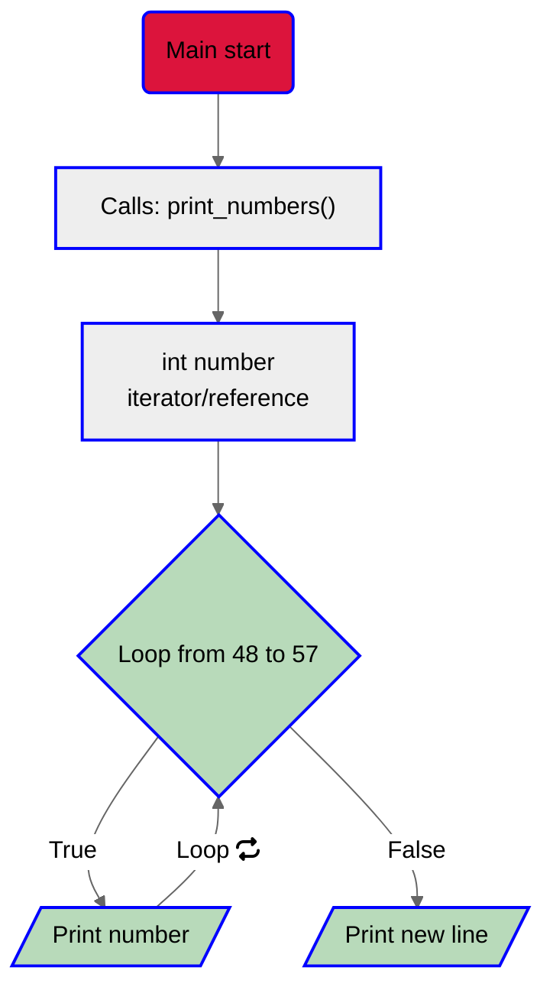

# New project: C - More functions, more nested loops.
## Taks 0
This task ask us to check if a given char is uppercase.

1. Read the task.
2. Set everything up (main, header files).
3. Code.<br
	3.1. Check if given char is in range.<br>
	3.2. if True return 1.<br>
	3.3. else return 0.<br>
	3.4. End.<br>
4. Flowchart:

5. [Code](https://github.com/KevinYeff/holbertonschool-low_level_programming/blob/main/more_functions_nested_loops/0-isupper.c)
6. Output:
```bash
$ ./a.out
A: 1
a: 0
$
```

## Task 1 
In this task  we need to check if a given digit is a number.
1. Read the task.
2. Set everything up (main, header files).
3. Code.<br>
	3.1. Check if given digit is in range.<br>
	3.2. if True return 1.<br>
	3.3. else return 0.<br>
	3.4. End.<br>
4. Flowchart:

5. [Code](https://github.com/KevinYeff/holbertonschool-low_level_programming/blob/main/more_functions_nested_loops/1-isdigit.c)

6. Output:
```bash
$ ./a.out
0: 1
a: 0
$
```
## Task 2
For this task we need to return the multiplication of 2 integers.
1. Read the task.
2. Set everything up (main, header files).
3. Code.<br>
	3.1. Multiply the integers.<br>
	3.2. return the result.<br>
4. Flowchart:

5. [Code](https://github.com/KevinYeff/holbertonschool-low_level_programming/blob/main/more_functions_nested_loops/2-mul.c)
6. Output:
```bash
$ ./a.out
100352
-1646592
$
```
## Task 3
This task asks us to print the numbers from 0 to 9.
1. Read the task.
2. Set everything up (main. header files).
3. Code. <br>
	3.1. Declare an iterator.<br>
	3.2. Use a `For Loop` to print under condition.<br>
	3.3. Print a new line after Loop ends.<br>
	3.4. End.<br>
4. Flowchart:

5. [Code](https://github.com/KevinYeff/holbertonschool-low_level_programming/blob/main/more_functions_nested_loops/3-print_numbers.c)
6. Output:
```bash
$ ./a.out 
0123456789
$
```
