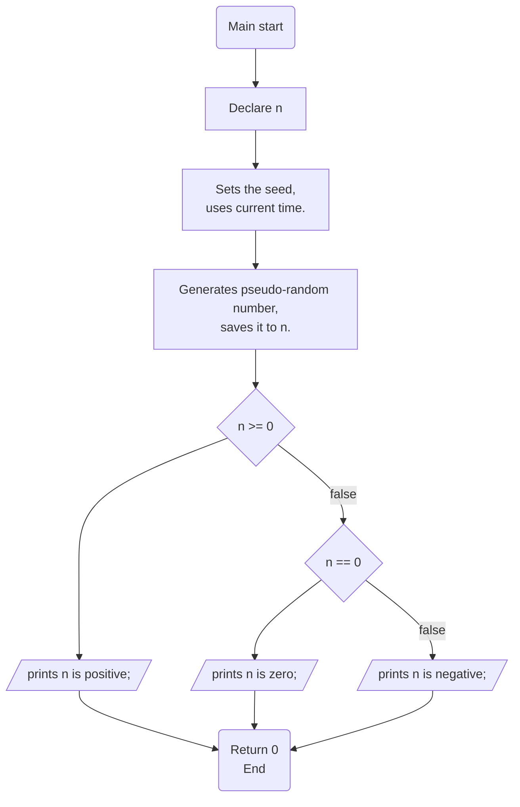
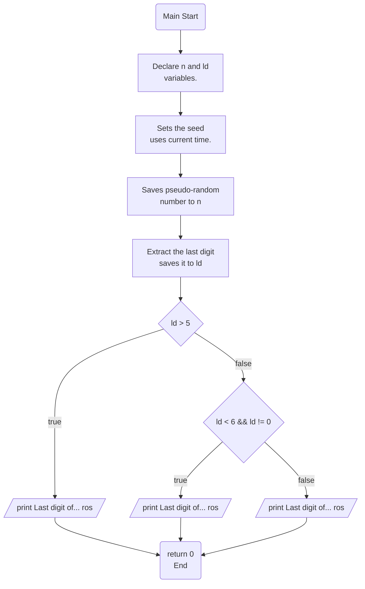
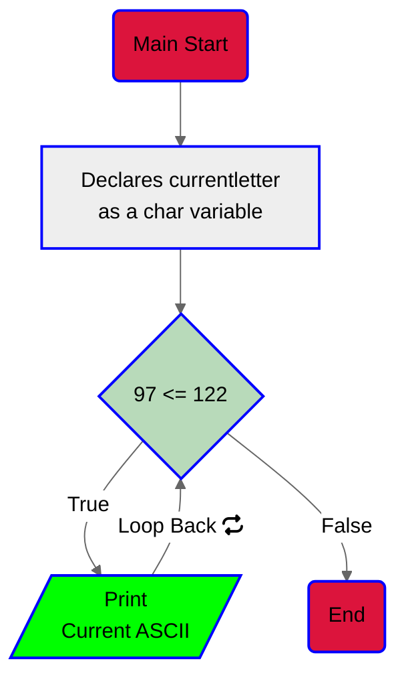
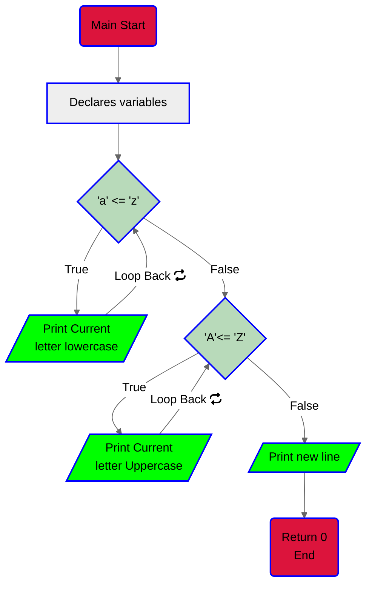
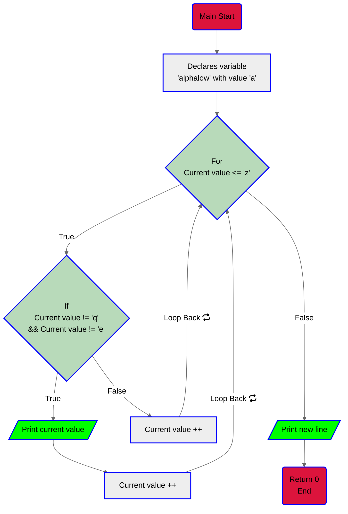
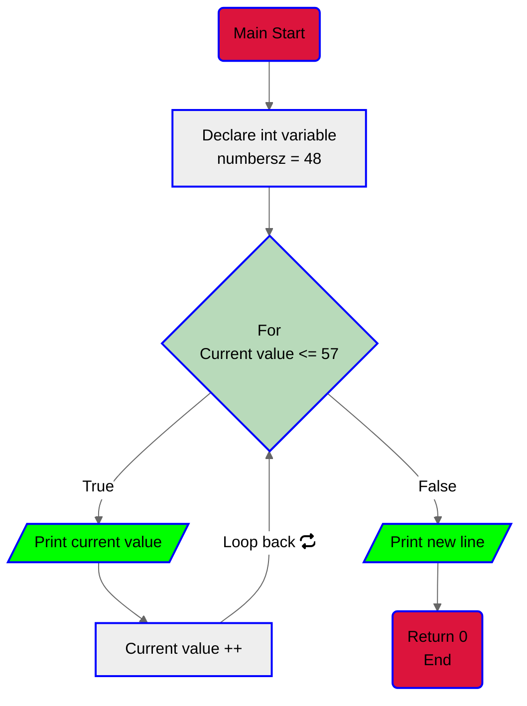
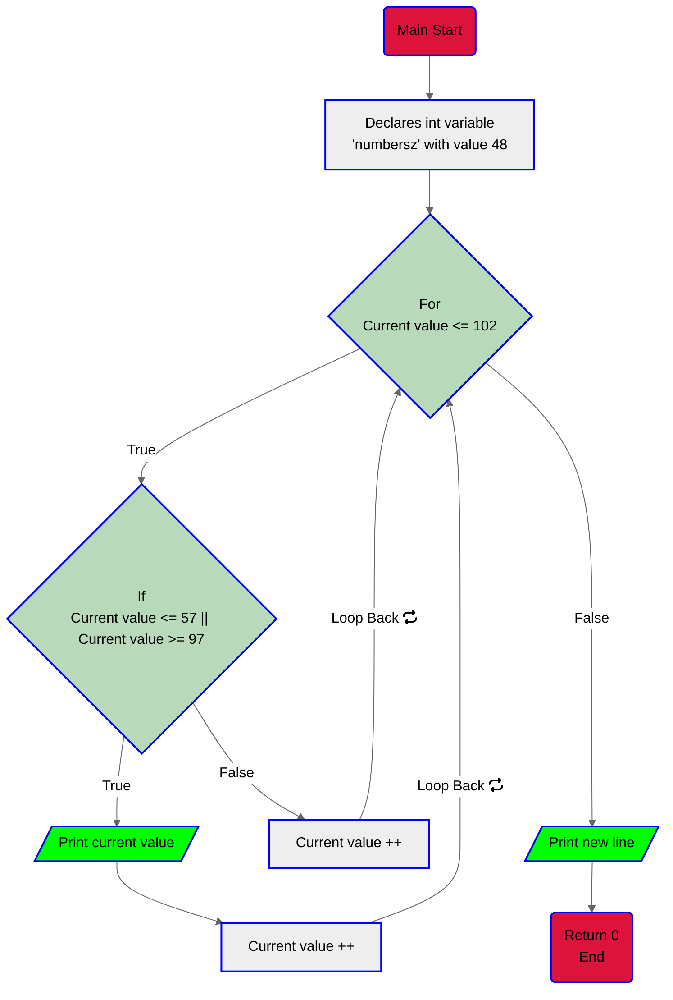
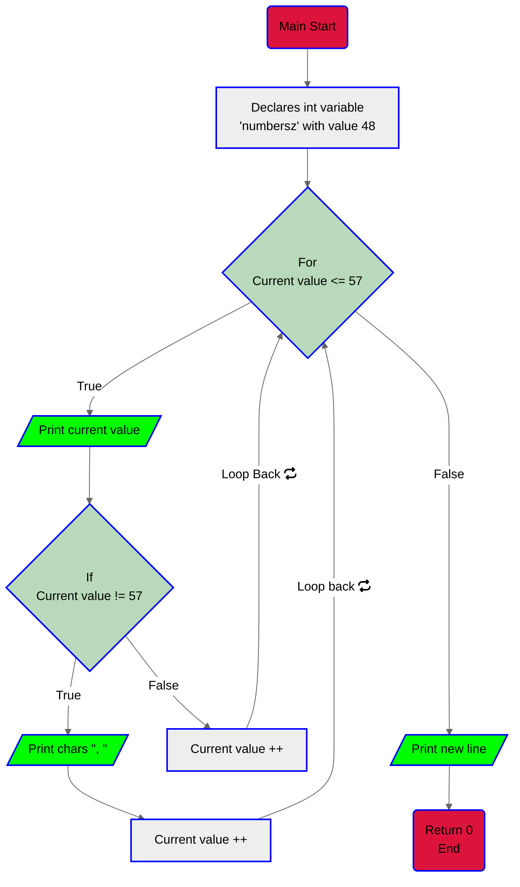
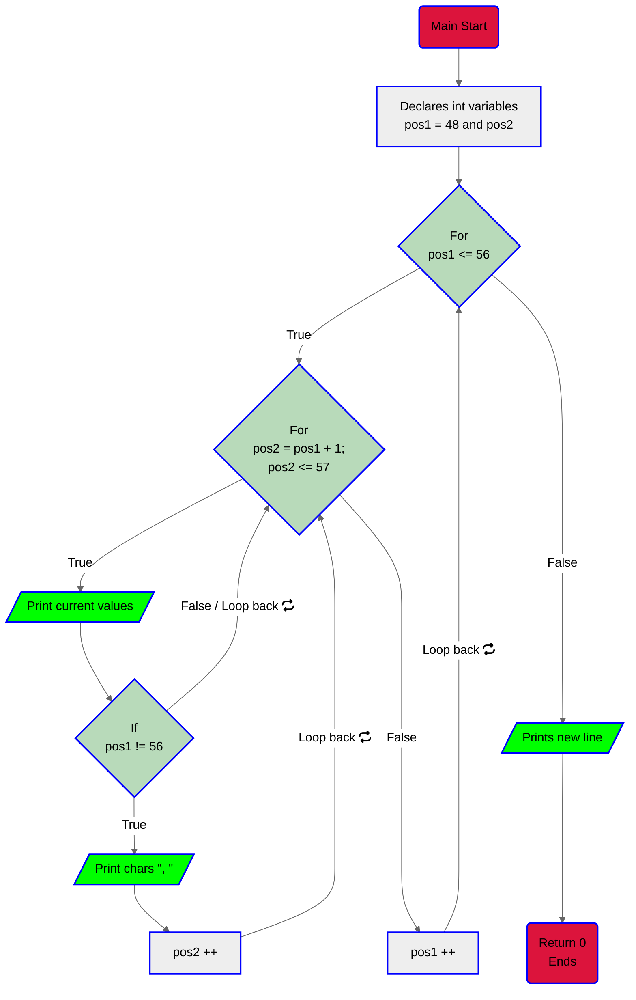
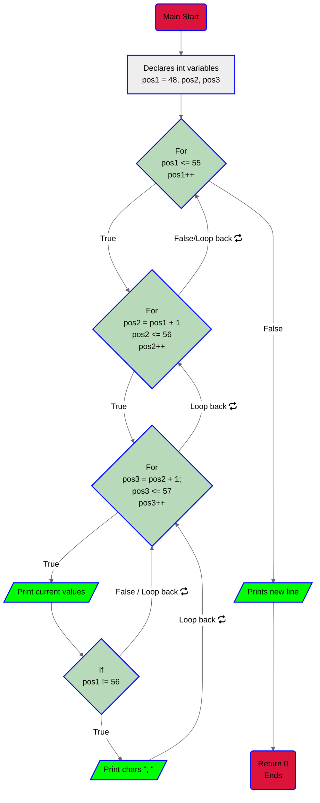

# This directory contains the tasks of the project C - Variables , if, else, while

## 0. Positive anything is better than negative nothing

This program will assign a random number to the variable n each time it is executed.
Complete the source code in order to print whether the number stored
in the vagriable n is positive or negative.


-  The variable n will store a different value every time you will run this
    program
    - You don’t have to understand what rand, srand, RAND_MAX do. Please do not
 touch this code
    - The output of the program should be:
    - The number, followed by
        - if the number is greater than 0: is positive
        - if the number is 0: is zero
        - if the number is less than 0: is negative
        - followed by a new line



[Code](https://github.com/KevinYeff/holbertonschool-low_level_programming/blob/main/variables_if_else_while/0-positive_or_negative.c)

Output:

``` bash
$ gcc -Wall -pedantic -Werror -Wextra -std=gnu89 0-positive_or_negative.c -o 0-positive_or_negative
$ ./0-positive_or_negative
-520693284 is negative
$ ./0-positive_or_negative
-973398895 is negative
$./0-positive_or_negative
0 is zero
```

> **_NOTE:_** <a href="https://man7.org/linux/man-pages/man3/srand.3p.html">`srand()`</a> uses the argument as a seed for a new sequence of pseudo-random numbers to be returned by subsequent calls to <a href="https://man7.org/linux/man-pages/man3/rand.3p.html">`rand()`</a>.

## 1. The last digit

This program will assign a random number to the variable n each time it is
executed. Complete the source code in order to print the last digit of the
number stored in the variable n.


- The variable n will store a different value every time you run this program
- You don’t have to understand what rand, srand, and RAND_MAX do.
- The output of the program should be:
    - The string Last digit of, followed by n
    - followed by
    - the string is, followed by
    - if the last digit of n is greater than 5: the string and is greater than 5
    - if the last digit of n is 0: the string and is 0
    - if the last digit of n is less than 6 and not 0: the string and is less
      than 6 and not 0
    - followed by a new line


[Code](https://github.com/KevinYeff/holbertonschool-low_level_programming/blob/main/variables_if_else_while/1-last_digit.c)

Output:

``` bash
$ gcc -Wall -pedantic -Werror -Wextra -std=gnu89 1-last_digit.c -o 1-last_digit
$ ./1-last_digit
Last digit of 220482792 is 2 and is less than 6 and not 0
$ ./1-last_digit
Last digit of 501324376 is 6 and is greater than 5
$ ./1-last_digit
Last digit of 705064120 is 0 and is 0
```
>**_NOTE:_** `ros` stands for "Rest of the string";<br>In order to extract the last digit of a number you must compute the modulus 10 of that number. 

## 2. I sometimes suffer from insomnia. And when I can't fall asleep, I play what I call the alphabet game

Program that prints the alphabet in lowercase, followed by a new line.

- You can only use the putchar function (every other function (printf, puts, etc…) is forbidden)
- All your code should be in the main function
- You can only use putchar twice in your code




[Code](https://github.com/KevinYeff/holbertonschool-low_level_programming/blob/main/variables_if_else_while/2-print_alphabet.c)

p
Output:
```bash
$ gcc -Wall -pedantic -Werror -Wextra -std=gnu89 2-print_alphabet.c -o 2-print_alphabet
$ ./2-print_alphabet
abcdefghijklmnopqrstuvwxyz
$
```
> **_NOTE:_** [`putchar()`](https://man7.org/linux/man-pages/man3/putchar.3p.html) also works with ascii values.


## 3. alphABET

C program that prints the alphabet in lowercase, and then in uppercase, followed by a new line.

- You can only use the putchar function (every other function (printf, puts, etc…) is forbidden)
- All your code should be in the main function
- You can only use putchar three times in your code



[Code](https://github.com/KevinYeff/holbertonschool-low_level_programming/blob/main/variables_if_else_while/3-print_alphabets.c)


Output:

``` bash
$ gcc -Wall -pedantic -Werror -Wextra -std=gnu89 3-print_alphabets.c -o 3-print_alphabets
$ ./3-print_alphabets | cat -e
abcdefghijklmnopqrstuvwxyzABCDEFGHIJKLMNOPQRSTUVWXYZ$
$
```

> **_NOTE:__** We can use ASCII Values to get the same output, rememner that every lowercase -32 is the same letter but uppercase.


## 4. When I was having that alphabet soup, I never thought that it would pay off

C program that prints the alphabet in lowercase, followed by a new line.

- Print all the letters except q and e
- printf and puts are forbidden, you can only use the putchar function
- All your code should be in the main function
- putchar can be used twice only



[Code](https://github.com/KevinYeff/holbertonschool-low_level_programming/blob/main/variables_if_else_while/4-print_alphabt.c)

Output:

``` bash
$ gcc -Wall -pedantic -Werror -Wextra -std=gnu89 4-print_alphabt.c -o 4-print_alphabt
$ ./4-print_alphabt
abcdfghijklmnoprstuvwxyz
$ ./4-print_alphabt | grep [eq]
$
```

> **_NOTE:__** We can use ASCII values.

## 5. Numbers
C program that prints all single digit numbers of base 10 starting from 0, followed by a new line.

- Main function only


[Code](https://github.com/KevinYeff/holbertonschool-low_level_programming/blob/main/variables_if_else_while/5-print_numbers.c)

Output:
``` bash
$ gcc -Wall -pedantic -Werror -Wextra -std=gnu89 5-print_numbers.c -o 5-print_numbers
$ ./5-print_numbers
0123456789
$
```

## 6. Numberz
C program that prints all single digit numbers of base 10 starting from 0,
followed by a new line.

- You are not allowed to use any variable of type char
- You can only use the putchar function (every other function (printf, puts, etc…) is forbidden)
- You can only use putchar twice in your code
- All your code should be in the main function



[Code](https://github.com/KevinYeff/holbertonschool-low_level_programming/tree/main/variables_if_else_while)

OutPut:

``` bash
$ gcc -Wall -pedantic -Werror -Wextra -std=gnu89 6-print_numberz.c -o 6-print_numberz
$ ./6-print_numberz
0123456789
$
```
> **_NOTE:_** Since putchar can accpet numbers we can use the ASCII values to match requirements.

## 7. Smile in the mirror

C program that prints the lowercase alphabet in reverse, followed by a new line.

- You can only use the putchar function (every other function (printf, puts, etc…) is forbidden)
- All your code should be in the main function
- You can only use putchar twice in your code


[Code](https://github.com/KevinYeff/holbertonschool-low_level_programming/blob/main/variables_if_else_while/7-print_tebahpla.c)

Output:

``` bash
$ gcc -Wall -pedantic -Werror -Wextra -std=gnu89 7-print_tebahpla.c -o 7-print_tebahpla
$ ./7-print_tebahpla
zyxwvutsrqponmlkjihgfedcba
$
```
> **_NOTE:__** You just need to start from the final :).

## 8. Hexadecimal

C program that prints all the numbers of base 16 in lowercase, followed by a new line.

- You can only use the putchar function
- All your code should be in the main function
- You can only use putchar three times in your code




[Code](https://github.com/KevinYeff/holbertonschool-low_level_programming/blob/main/variables_if_else_while/8-print_base16.c)

Output:
```bash
$ gcc -Wall -pedantic -Werror -Wextra -std=gnu89 8-print_base16.c -o 8-print_base16
$ ./8-print_base16
0123456789abcdef
```
> **_NOTE:_** Treat ASCII as an array & extract what you need :).

##  9. Patience, persistence and perspiration make an unbeatable combination for success

C program that prints all possible combinations of single-digit numbers.

- Numbers must be separated by ,, followed by a space
- Numbers should be printed in ascending order
- You can only use the putchar function (every other function (printf, puts, etc…) is forbidden)
- All your code should be in the main function
- You can only use putchar four times maximum in your code
- You are not allowed to use any variable of type char


[Code](https://github.com/KevinYeff/holbertonschool-low_level_programming/blob/main/variables_if_else_while/9-print_comb.c)

Output:
```bash
$ gcc -Wall -pedantic -Werror -Wextra -std=gnu89 9-print_comb.c -o 9-print_comb
$ ./9-print_comb | cat -e
0, 1, 2, 3, 4, 5, 6, 7, 8, 9$
$
```
> **_NOTE:_** You can condition the format output targeting the last value :)

##  10. Inventing is a combination of brains and materials. The more brains you use, the less material you need

C program that prints all possible different combinations of two digits.

- Numbers must be separated by ,, followed by a space
- The two digits must be different
- 01 and 10 are considered the same combination of the two digits 0 and 1
- Print only the smallest combination of two digits
- Numbers should be printed in ascending order, with two digits
- You can only use the putchar function (every other function (printf, puts, etc…) is forbidden)
- You can only use putchar five times maximum in your code
- You are not allowed to use any variable of type char
- All your code should be in the main function



[Code](https://github.com/KevinYeff/holbertonschool-low_level_programming/blob/main/variables_if_else_while/100-print_comb3.c)

Output:
```bash
$ gcc -Wall -pedantic -Werror -Wextra -std=gnu89 100-print_comb3.c -o 100-print_comb3
$ ./100-print_comb3
01, 02, 03, 04, 05, 06, 07, 08, 09, 12, 13, 14, 15, 16, 17, 18, 19, 23, 24, 25, 26, 27, 28, 29, 34, 35, 36, 37, 38, 39, 45, 46, 47, 48, 49, 56, 57, 58, 59, 67, 68, 69, 78, 79, 89
$
```
> **_NOTE:_** If you know the output, try to condition the loops so that they do not do more steps than required!

## 11. The success combination in business is: Do what you do better... and: do more of what you do...
C program that prints all possible different combinations of three digits.

- Numbers must be separated by ,, followed by a space
- The three digits must be different
- 012, 120, 102, 021, 201, 210 are considered the same combination of the three digits 0, 1 and 2
- Print only the smallest combination of three digits
- Numbers should be printed in ascending order, with three digits
- You can only use the putchar function (every other function (printf, puts, etc…) is forbidden)
- You can only use putchar six times maximum in your code
- You are not allowed to use any variable of type char
- All your code should be in the main function


[Code](https://github.com/KevinYeff/holbertonschool-low_level_programming/blob/main/variables_if_else_while/101-print_comb4.c)

Output:
```bash
$ gcc -Wall -pedantic -Werror -Wextra -std=gnu89 101-print_comb4.c -o 101-print_comb4
$ ./101-print_comb4
012, 013, 014, 015, 016, 017, 018, 019, 023, 024, 025, 026, 027, 028, 029, 034, 035, 036, 037, 038, 039, 045, 046, 047, 048, 049, 056, 057, 058, 059, 067, 068, 069, 078, 079, 089, 123, 124, 125, 126, 127, 128, 129, 134, 135, 136, 137, 138, 139, 145, 146, 147, 148, 149, 156, 157, 158, 159, 167, 168, 169, 178, 179, 189, 234, 235, 236, 237, 238, 239, 245, 246, 247, 248, 249, 256, 257, 258, 259, 267, 268, 269, 278, 279, 289, 345, 346, 347, 348, 349, 356, 357, 358, 359, 367, 368, 369, 378, 379, 389, 456, 457, 458, 459, 467, 468, 469, 478, 479, 489, 567, 568, 569, 578, 579, 589, 678, 679, 689, 789
$
```
> **_NOTE:_** This one is a litle bit spicy but the previous one is a great start.

# Contact

<p align="center">
  
  <br>
  <a href="https://github.com/KevinYeff"><h>Kevin Espinoza</h></a>
</p>

<p align="center">
<a href="https://twitter.com/missingyeff" target="blank"></a>
<a href="https://www.linkedin.com/in/kevin-espinoza-salguedo-81a0a223b/" target="blank"></a>
<a href="https://github.com/KevinYeff" target="blank"></a>

</p>