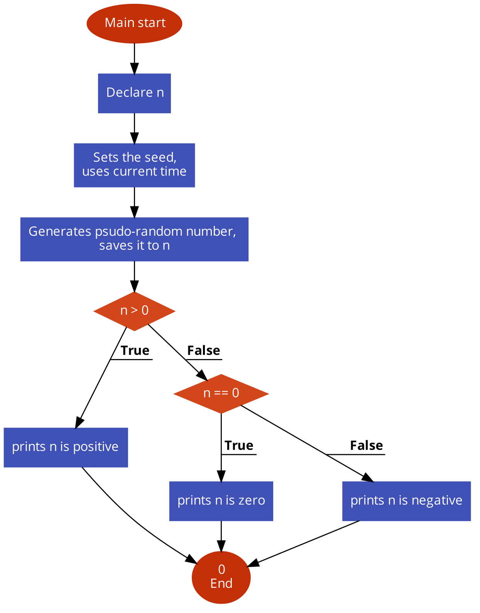

# This directory contains the tasks of the project C - Variables , if, else,

## 0. Positive anything is better than negative nothing

This program will assign a random number to the variable n each time it is executed.
Complete the source code in order to print whether the number stored
in the vagriable n is positive or negative.


-  The variable n will store a different value every time you will run this
    program
    - You don’t have to understand what rand, srand, RAND_MAX do. Please do not
 touch this code
    - The output of the program should be:
    - The number, followed by
        - if the number is greater than 0: is positive
        - if the number is 0: is zero
        - if the number is less than 0: is negative
        - followed by a new line


[Code]( https://github.com/KevinYeff/holbertonschool-low_level_programming/blob/main/variables_if_else_while/0-positive_or_negative.c)

Output:

``` bash
$ gcc -Wall -pedantic -Werror -Wextra -std=gnu89 0-positive_or_negative.c -o 0-positive_or_negative
$ ./0-positive_or_negative
-520693284 is negative
$ ./0-positive_or_negative
-973398895 is negative
$./0-positive_or_negative
0 is zero
```

> **_NOTE:_** <a href="https://man7.org/linux/man-pages/man3/srand.3p.html">`srand()`</a> uses the argument as a seed for a new sequence of pseudo-random numbers to be returned by subsequent calls to <a href="https://man7.org/linux/man-pages/man3/rand.3p.html">`rand()`</a>.
